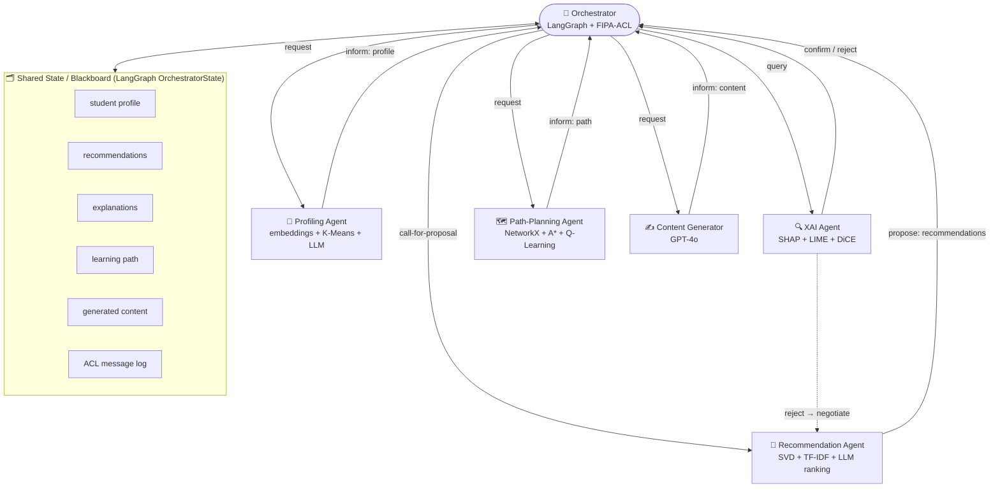

# 🎓 Explainable Multi-Agent E-Learning System

> Six specialized agents turn raw e-learning clickstream data into **personalized, explainable** learning paths — recommending, justifying, and planning instead of returning a single black-box score.

[](https://explainable-multi-agent-elearning-cqqxhnzwcai9nbjmpsji6z.streamlit.app/)


**▶️ Live demo:** https://explainable-multi-agent-elearning-cqqxhnzwcai9nbjmpsji6z.streamlit.app/
*(runs on synthetic demo data — the full OULAD dataset isn't bundled)*

---

## The problem

Online courses (MOOCs, LMS platforms) generate huge amounts of behavioral data — clicks, page views, quiz scores — yet most learners still get a **one-size-fits-all** experience and high dropout rates. The recommenders that do exist are usually **black boxes**: they tell a student *what* to do next but never *why*, which makes them hard to trust in an educational setting where a wrong nudge wastes a learner's time.

This project explores a **multi-agent** answer: rather than one monolithic model, a set of specialized agents each own one sub-problem (who is this learner? what should they do next? why? in what order? with what materials?) and hand structured results to one another through a shared orchestration state. Every recommendation comes with an **explanation** (SHAP / LIME / counterfactuals) and a **planned path**, not just a ranking.

The system is built and evaluated on the **[Open University Learning Analytics Dataset (OULAD)](https://analyse.kmi.open.ac.uk/open_dataset)** (Kuzilek et al., 2017).

---

## Architecture

A central **orchestrator** holds a shared state object (a "blackboard") and routes work between agents using **FIPA-ACL** style messages (`request`, `propose`, `inform`, `confirm`, `reject`, `call-for-proposal`). The design includes a **negotiation loop**: if the explainability agent cannot justify a recommendation, control returns to the recommender to propose alternatives before the path is planned.



**How the negotiation is meant to work:** the recommender *proposes*, the XAI agent *accepts or rejects* on explainability grounds, and a rejection triggers a feedback loop (a re-`request` with a "must be explainable" constraint) rather than passing a black-box result downstream. Path planning and content generation only proceed once recommendations are validated.

> ### ⚠️ Implementation status (read before evaluating the code)
> Be clear-eyed about what runs today:
> - **Fully implemented & runnable:** the five domain agents (profiling, recommendation, XAI, path planning, content generation) and the evaluation suite. `main.py` runs them end-to-end as a **sequential pipeline** on real OULAD data, and the **Streamlit dashboard** drives the same agents interactively.
> - **Scaffold:** the orchestrator in [`src/orchestrator.py`](src/orchestrator.py) implements the LangGraph workflow, the FIPA-ACL message types, and the negotiation routing **as a working graph**, but its agent nodes currently return **placeholder outputs** rather than calling the five real agents. It demonstrates the negotiation/blackboard *pattern*; wiring it to the live agents is the top item on the roadmap.
>
> See [Roadmap](#roadmap) for what's planned next.

---

## The agents

| Agent | File | What it actually does |
|-------|------|------------------------|
| **Profiling** | [`profiling_agent.py`](src/agents/profiling_agent.py) | Builds learner features, embeds them with `text-embedding-3-small`, clusters with **K-Means**, and asks an LLM to interpret each cluster into a learning style / engagement level. |
| **Recommendation** | [`recommendation_agent.py`](src/agents/recommendation_agent.py) | **Collaborative filtering** via Truncated **SVD** + **content-based** filtering via **TF-IDF**, blended into a hybrid score, then **LLM re-ranking**. Evaluated with NDCG / MRR / Recall / Precision. |
| **XAI** | [`xai_agent.py`](src/agents/xai_agent.py) | Real **SHAP**, **LIME**, and **DiCE counterfactuals** over the model's features, turned into a natural-language explanation by an LLM. |
| **Path planning** | [`path_planning_agent.py`](src/agents/path_planning_agent.py) | Builds a prerequisite knowledge graph in **NetworkX**, then plans a learning path with **A\*** search, **Q-Learning**, and topological sort, and picks the best of the three. |
| **Content generation** | [`content_generator.py`](src/agents/content_generator.py) | Generates quizzes and topic summaries with **GPT-4o** (with JSON-repair and offline fallbacks). |
| **Orchestration** | [`orchestrator.py`](src/orchestrator.py) | **LangGraph** workflow + **FIPA-ACL** messaging + negotiation loop over a shared state (currently a scaffold — see status note above). |

---

## Key capabilities

- 🧩 **Specialized agents** for profiling, recommendation, explanation, planning, and content generation.
- 🔍 **Explanations by default** — every recommendation is backed by SHAP/LIME/counterfactual evidence, not just a score.
- 🗺️ **Algorithmic path planning** — A*, reinforcement learning (Q-Learning), and topological ordering, compared head-to-head.
- 🔀 **Hybrid recommendation** — collaborative + content-based + LLM ranking.
- 📊 **Proper evaluation** — temporal holdout split with NDCG@K, MRR, Recall@K, Precision@K for recommendations, BERTScore/ROUGE for generation, and custom faithfulness/plausibility/consistency for explanations.
- 🖥️ **Interactive dashboard** — a Streamlit app to explore profiles, recommendations, explanations, and paths.

---

## Tech stack

| Area | Tools |
|------|-------|
| **LLM** | Azure OpenAI (GPT-4o, `text-embedding-3-small`) via the `openai` SDK |
| **Orchestration** | LangGraph, FIPA-ACL message model |
| **Classical ML** | scikit-learn (K-Means, TruncatedSVD, TF-IDF) |
| **Explainability** | SHAP, LIME, DiCE |
| **Planning / RL** | NetworkX, A* search, Q-Learning |
| **Evaluation** | BERTScore, ROUGE, custom XAI metrics |
| **UI** | Streamlit, Plotly |

---

## Project structure

```
elearning-mas-v2/
├── main.py                     # End-to-end pipeline entry point
├── requirements.txt
├── .env.example                # Copy to .env and add your credentials
├── LICENSE                     # MIT
├── src/
│   ├── agents/
│   │   ├── profiling_agent.py
│   │   ├── recommendation_agent.py
│   │   ├── xai_agent.py
│   │   ├── path_planning_agent.py
│   │   └── content_generator.py
│   ├── orchestrator.py         # LangGraph + FIPA-ACL orchestration (scaffold)
│   └── evaluation/
│       └── metrics.py          # NDCG, MRR, BERTScore, ROUGE, XAI metrics
├── dashboard/                  # Streamlit UI (see dashboard/README.md)
│   ├── app.py
│   ├── components/
│   └── utils/pipeline_runner.py
├── tests/                      # Standalone smoke tests
│   ├── test_xai.py
│   └── test_azure_openai.py
├── scripts/                    # One-off debugging utilities
├── assets/                     # Screenshots / demo GIF (see assets/README.md)
└── data/oulad/                 # OULAD CSVs (downloaded separately, gitignored)
```

---

## Setup

### 1. Clone & create a virtual environment

```bash
python -m venv venv
# Windows
venv\Scripts\activate
# Linux / macOS
source venv/bin/activate
```

### 2. Install dependencies

```bash
pip install -r requirements.txt
```

### 3. Configure credentials

```bash
cp .env.example .env        # Windows: copy .env.example .env
```

Then edit `.env` with your Azure OpenAI details:

```env
AZURE_OPENAI_ENDPOINT=https://<your-resource>.cognitiveservices.azure.com/
AZURE_OPENAI_API_KEY=<your-azure-openai-api-key>
AZURE_OPENAI_CHAT_DEPLOYMENT=gpt-4o
AZURE_OPENAI_EMBEDDING_DEPLOYMENT=text-embedding-3-small
AZURE_OPENAI_API_VERSION=2024-12-01-preview
```

> `.env` is gitignored — never commit real keys. Verify your connection with `python -m tests.test_azure_openai`.

### 4. Get the data

Download the **OULAD** dataset and extract the CSVs into `data/oulad/`:

- Source: https://analyse.kmi.open.ac.uk/open_dataset
- Files used: `studentInfo.csv`, `studentVle.csv`, `studentAssessment.csv`, `vle.csv` (plus `assessments.csv`, `courses.csv`)

> If the data is missing, `main.py` automatically falls back to **synthetic data** so the pipeline still runs.

---

## Run

### Full pipeline (CLI demo)

```bash
python main.py
```

This loads the data, profiles a student, generates and evaluates recommendations, explains them with SHAP/LIME/DiCE, plans a learning path with A*/Q-Learning, and generates content — printing results and metrics at each stage.

### Interactive dashboard

```bash
pip install -r dashboard/requirements_dashboard.txt
streamlit run dashboard/app.py
```

See [`dashboard/README.md`](dashboard/README.md) for details. Add screenshots / a demo GIF to [`assets/`](assets/) and embed them here.

### Orchestrator scaffold

```bash
python -m src.orchestrator
```

Runs the LangGraph negotiation graph and prints the FIPA-ACL communication log (on placeholder outputs — see the status note above).

---

## Deploy (Streamlit Community Cloud)

The dashboard runs on [Streamlit Community Cloud](https://share.streamlit.io) for free:

1. Push this repo to GitHub.
2. On Streamlit Cloud → **New app** → pick this repo, branch `main`, main file `dashboard/app.py`.
3. **Advanced settings → Secrets**: paste your Azure credentials in TOML form
   (see [`.streamlit/secrets.toml.example`](.streamlit/secrets.toml.example)).
4. Deploy.

The 443 MB OULAD dataset is **not** bundled, so the cloud app automatically falls back to
**synthetic demo data** (the UI shows a banner). For real metrics, run locally with the OULAD CSVs in `data/oulad/`.

> The deployed agents make real Azure OpenAI calls on each run — set an Azure **spending limit** before sharing the link publicly.

## Evaluation

The pipeline reports the following (computed live per run — this README intentionally does **not** quote fixed numbers, since they depend on the chosen student and split):

| Category | Metrics |
|----------|---------|
| **Recommendations** | NDCG@K, MRR, Recall@K, Precision@K (temporal holdout split) |
| **Generation** | BERTScore, ROUGE-1/2/L |
| **Explainability** | Faithfulness, Plausibility, Consistency, Trust score |

---

## Roadmap

Honest list of what's designed but not yet wired:

- [ ] Wire the orchestrator's LangGraph nodes to call the **real** agents (replace placeholder outputs) so the negotiation loop runs on live recommendations.
- [ ] Add **AutoGen**-based agent-to-agent conversations as an alternative to the LangGraph orchestrator.
- [ ] Implement **RAG** for the content generator (vector store + retrieval) — currently pure LLM generation.
- [ ] Expose the pipeline behind a **REST API** (e.g. FastAPI) in addition to the Streamlit UI.

---

## References

- **OULAD**: Kuzilek, J., Hlosta, M., & Zdrahal, Z. (2017). *Open University Learning Analytics dataset.*
- **SHAP**: Lundberg & Lee (2017). - **LIME**: Ribeiro et al. (2016). - **DiCE**: Mothilal et al. (2020).
- **LangGraph**: LangChain. - **FIPA-ACL**: FIPA Agent Communication Language specification.

---

